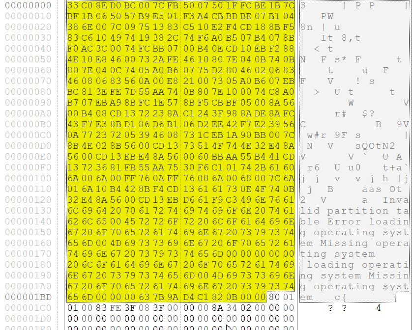

# Analyzing MBR for forensics investigations

## Introduction

Master Boot Record is the first sector of a hard disk and the place where all the information about the disk and booting can be found. It is the most essential part of the booting process. Along with the bootloader program, MBR also contains details regarding the partitions of the hard disk. The size of MBR is commonly less than or equal to **512 bytes.** It is a disk data structure that is created once the disk is partitioned.&#x20;

MBR exists only in partitioned storage devices and cannot be found in non-partitioned disk like floppy disk, and it contains a small amount of executable code called the master boot code, the disk signature, and the partition table for the disk. At the end of the MBR is a 2-byte structure called a signature word or end of sector marker, which is always set to 0x55AA.

When a computer is first turned on, it runs a special program called **Basic Input Output System (BIOS) that is stored in the Read-Only Memory (ROM)**. BIOS contains the code that locates and executes MBR. MBR contains a partition table holding locations of various hard disk partitions which further helps in loading the operating system.

<figure><figcaption></figcaption></figure>

Since MBR is controlling booting process after the BIOS finish its job, make susceptible by malware and some potential threats. Some malicious programs may get control over booting process by altering the MBR and load malicious software to the memory. Moreover, malware like ransomware may move the MBR to different location on the disk and replace itself on the first sector of the disk. Therefore, it carries out the booting process by executing its code once the BIOS switch to the drive for booting.

## MBR structure&#x20;

<figure><figcaption></figcaption></figure>

### Master boot code (bootstrap)&#x20;

The _master boot code_ performs the following activities:

1. Scans the partition table for the active partition.
2. Finds the starting sector of the active partition.
3. Loads a copy of the boot sector from the active partition into memory.
4. Transfers control of booting process to the executable code in the boot sector.

If the master boot code cannot complete these functions, the system displays one of the following error messages:

`Invalid partition table.`

`Error loading operating system.`

`Missing operating system.`

### Partition table

The partition table, a 64-byte data structure used to identify the type and location of partitions on a hard disk, conforms to a standard layout independent of the operating system. Each partition table entry is 16 bytes long, with a maximum of four entries. One of these partitions is marked as an active partition which is used to continue booting process in the computer. The size of the partition table is distributed equally among the four partitions.

Each entry starts at a predetermined offset from the beginning of the sector, as follows:

* Partition 10x01BE(446)
* Partition 20x01CE(462)
* Partition 30x01DE(478)
* Partition 40x01EE(494)

Usually, MBR allows only for one active partition for booting process; however in some cases more than one active partition may exists that cause the MBR to return an error message. Active partition loads files to memory based on the type of the file system used by the partition. In case of missing the active partition, it will be difficult to recover and restore data stored in the disk . Once the active partition is founded, much information may be extracted during analysis process such as the filesystem used by the partition and the size of the partition

|                                                                                                                                                                                                                                                                                                                                                                                                                                                                                                                                                                                                                                                                                                                                                   |              |              |                                                                                                                                                                                                           |
| ------------------------------------------------------------------------------------------------------------------------------------------------------------------------------------------------------------------------------------------------------------------------------------------------------------------------------------------------------------------------------------------------------------------------------------------------------------------------------------------------------------------------------------------------------------------------------------------------------------------------------------------------------------------------------------------------------------------------------------------------- | ------------ | ------------ | --------------------------------------------------------------------------------------------------------------------------------------------------------------------------------------------------------- |
| Byte Offset                                                                                                                                                                                                                                                                                                                                                                                                                                                                                                                                                                                                                                                                                                                                       | Field Length | Sample Value | Field Name and Definition                                                                                                                                                                                 |
| 0x01BE                                                                                                                                                                                                                                                                                                                                                                                                                                                                                                                                                                                                                                                                                                                                            | BYTE         | 0x80         | **Boot Indicator** . Indicates whether the volume is the active partition. Legal values include: 00. Do not use for booting. 80. Active partition.                                                        |
| 0x01BF                                                                                                                                                                                                                                                                                                                                                                                                                                                                                                                                                                                                                                                                                                                                            | BYTE         | 0x01         | **Starting Head** .                                                                                                                                                                                       |
| 0x01C0                                                                                                                                                                                                                                                                                                                                                                                                                                                                                                                                                                                                                                                                                                                                            | 6 bits       | 0x01 \*      | **Starting Sector** . Only bits 0-5 are used. The upper two bits, 6 and 7, are used by the Starting Cylinder field.                                                                                       |
| 0x01C1                                                                                                                                                                                                                                                                                                                                                                                                                                                                                                                                                                                                                                                                                                                                            | 10 bits      | 0x00 \*      | **Starting Cylinder** . Uses 1 byte in addition to the upper 2 bits from the Starting Sector field to make up the cylinder value. The Starting Cylinder is a 10-bit number, with a maximum value of 1023. |
| 0x01C2                                                                                                                                                                                                                                                                                                                                                                                                                                                                                                                                                                                                                                                                                                                                            | BYTE         | 0x07         | **System ID** . Defines the volume type. See Table 32.3 for sample values.                                                                                                                                |
| 0x01C3                                                                                                                                                                                                                                                                                                                                                                                                                                                                                                                                                                                                                                                                                                                                            | BYTE         | 0xFE         | **Ending Head** .                                                                                                                                                                                         |
| 0x01C4                                                                                                                                                                                                                                                                                                                                                                                                                                                                                                                                                                                                                                                                                                                                            | 6 bits       | 0xBF \*      | **Ending Sector** . Only bits 0-5 are used. The upper two bits, 6 and 7, are used by the Ending Cylinder field.                                                                                           |
| 0x01C5                                                                                                                                                                                                                                                                                                                                                                                                                                                                                                                                                                                                                                                                                                                                            | 10 bits      | 0x09 \*      | **Ending Cylinder** . Uses 1 byte in addition to the upper 2 bits from the Ending Sector field to make up the cylinder value. The Ending Cylinder is a 10-bit number, with a maximum value of 1023.       |
| 0x01C6                                                                                                                                                                                                                                                                                                                                                                                                                                                                                                                                                                                                                                                                                                                                            | DWORD        | 0x3F000000   | **Relative Sectors** . The offset from the beginning of the disk to the beginning of the volume, counting by sectors.                                                                                     |
| 0x01CA                                                                                                                                                                                                                                                                                                                                                                                                                                                                                                                                                                                                                                                                                                                                            | DWORD        | 0x4BF57F00   | **Total Sectors** . The total number of sectors in the volume.                                                                                                                                            |
| 
A BYTE is 8 bits, a WORD is 16 bits, a DWORD is 32 bits, and a LONGLONG is 64 bits. Sample values marked with an asterisk (*) do not accurately represent the value of the fields, because the fields are either 6 bits or 10 bits and the data is recorded in bytes. Numbers larger than one byte are stored in little endian format, or reverse-byte ordering. Little endian format is a method of storing a number so that the least significant byte appears first in the hexadecimal number notation. For example, the sample value for the <strong>Relative Sectors</strong> field in the previous table, 0x3F000000, is a little endian representation of 0x0000003F. The decimal equivalent of this little endian number is 63.
 |              |              |                                                                                                                                                                                                           |

### Boot Record Signature

Boot Record Signature is located at the end of the MBR that can be also named as Magic Number. It is a smallest unit in MBR structure that contains only two bytes that is required by the BIOS during booting. The magic number used to report the availability of the boot loader in the hard disk. If the boot loader is located, the magic number value should be (55AA) in hexadecimal calculation

## MBR ANALYSIS EXPERIMENT

the Master Boot Record (MBR) is an important component of a hard disk, and it can be analyzed in forensic investigations to extract or recover important information. Malicious software may also infect the MBR, which can overwrite the clean MBR, and forensic investigators need to be able to distinguish between the two.

The MBR structure consists of 512 bytes divided into three parts: the boot loader code, the partition table, and the boot signature. Here's a table that specifies the location of each part in terms of decimal, hex, and binary:

| Part             | Start Location (Decimal) | Start Location (Hex) | Start Location (Binary) |
| ---------------- | ------------------------ | -------------------- | ----------------------- |
| Boot Loader Code | 0                        | 0x0                  | 00000000                |
| Partition Table  | 446                      | 0x1BE                | 11100110                |
| Boot Signature   | 510                      | 0x1FE                | 11111110                |

The boot loader code is located at the beginning of the MBR, and it's responsible for loading the operating system. The partition table is located after the boot loader code and describes the layout of the partitions on the hard disk. The boot signature is located at the end of the MBR and is used to indicate that the MBR is valid.

By studying the standard MBR structure and examining these three parts, forensic investigators can identify any differences between a clean and malicious MBR. For example, a malicious MBR may contain code that tries to hide its presence or modify the partition table in a way that is not consistent with the expected partition layout.

The table specifies the specific offsets where the boot loader code, partition table, and boot signature are located within the MBR, and these offsets are consistent across different machines. Therefore, forensic investigators can look for these patterns at these specific offsets during an investigation, and finding MBR patterns in different offsets may indicate the presence of potential MBRs in memory.

However, it's important to note that not all MBR patterns found in memory will be malicious. In some cases, there may be legitimate copies of the MBR in memory, such as backups or copies created by the operating system. Forensic investigators need to carefully analyze any MBR patterns found and determine whether they are legitimate or potentially malicious.

A number of tools are used to extract the required information and analyze the MBR that simplify the investigation. Generally, it is important to use an accurate tool to extract evidences from MBR during forensic analysis. In this research, fileinsight is used to analyze the MBR and get accurate information.

The research is analyzing a previously captured MBR to find Bootstrap Code Area, Active Partition and Boot Record Signature as following:

<mark style="color:blue;">**Bootstrap Code Area**</mark>

bootstrap code area is located in the offset (000 – 445) which referred to (000 – 1BD) in hex. Since the bootstrap existing in the correct offset; then it is ready to scan the partition table to find the active partition and load the boot sector into memory.

<figure><figcaption>
Bootstrap Code Area in Hex
</figcaption></figure>

<mark style="color:blue;">**Partition Table**</mark>

The partition table is located immediately after the boot loader code in the MBR, and it consists of four entries, each of which describes a partition on the hard disk. Each partition table entry is 16 bytes long, which means the partition table spans from offset 1BE (446) to offset 1FD (509) in the MBR.

Forensic investigators can examine the partition table to find information about the available partitions on the hard disk, such as their size, starting and ending sectors, and type. They can also determine which partition is marked as the active or bootable partition, as this is the partition that the boot loader code will load the boot sector from. In addition, the partition table can also specify if there is an extended partition present, which can contain additional logical partitions within it.

It's important to note that the partition table can also be a target for malware or other malicious code, as an attacker can modify the partition table entries to hide their presence or create additional partitions that may contain malicious code. This is why forensic investigators need to carefully examine the partition table and compare it to the expected partition layout to identify any potential threats or malicious activity.

<figure><figcaption>
Partition Table Entries in Hex
</figcaption></figure>

The Hex Viewer tool has detected only one active partition in the partition table, which is marked with the value 0x80 in the first byte of its partition table entry. This indicates that this partition is the active or bootable partition, and the boot loader code will load the boot sector from this partition during the boot process.

The other partitions in the partition table are marked as non-active, with a value of 0x00 in the first byte of their partition table entry. This means that these partitions are not bootable, and the boot loader code will not attempt to load the boot sector from these partitions.

Based on the given result, only one partition will be analyzed that is the active partition. Each hexadecimal value in this active partition will be examined to extract the required information like starting and ending sectors in [CHS ](https://en.wikipedia.org/wiki/Cylinder-head-sector)values, the file system and the size of the partition.&#x20;

This structure consists of 16 bytes and is divided into six different fields that contain different pieces of information about the partition. The following table shows the structure of a partition table entry:

| Offset | Length                              | Field Name     | Description                                                                                                                                                                              |
| ------ | ----------------------------------- | -------------- | ---------------------------------------------------------------------------------------------------------------------------------------------------------------------------------------- |
| 0      | 1 byte (80)                         | Boot Indicator | Indicates if the partition is bootable (0x80 = bootable)                                                                                                                                 |
| 1-3    | 
3 bytes 

(01 01 00)
    | CHS Start      | 
The starting cylinder, head, and sector of the partition.

In hex, are read in reverse case as 00 01 01.
                                                                     |
| 4      | 1 byte (83)                         | Partition Type | 
The type of partition (e.g., FAT, NTFS, etc.) 

0x83: Linux native file systems (ext2/3/4, JFS, Reiser, xiafs, and others).
                                                  |
| 5-7    | 
3 bytes 

(FE 3F 08)
    | CHS End        | The ending cylinder, head, and sector of the partition In hex, are read in reverse case as 08 3F FE                                                                                      |
| 8-11   | 
4 bytes 

(3F 00 00 00)
 | LBA Start      | 
The starting sector of the partition in LBA (logical block addressing) mode

00 00 00 3F = sector n°63
                                                                       |
| 12-15  | 
4 bytes 

(8A 34 02 00)
 | LBA Size       | 
The size of the partition in sectors in LBA mode 

Read in hex as: 00 02 34 8A. The size in sector is 144522 sector (decimal) 

The size in Megabytes is: 73.995264 MB 
 |

\
As mentioned in the above table, the used file system is ext. The partition start at sector 63 and the size of the partition is Megabytes.

#### <mark style="color:blue;">Boot record signature</mark>

Locating the Boot record signature or the magic number requires searching in the offsets 1FE and 1FF that represent the 2-byte value as (55 AA) in hex

Most required information is extracted easily from the MBR since it has a standard structure followed by most computer machines. In this research, only one active partition is analyzed to clarify the basic structure of the MBR and to extract the required disk information for forensic investigations.

## conclusion

MBR is an essential part in the computer that is physically located in the first sector of the disk and controls the booting process in the computer. As presented in this research, all MBR patterns are located in standard locations in the first sector. Therefore, studying its structure is required to make sure that the computer is not infected by malicious programs like malware that may replace the MBR and load malicious software to the computer memory during booting process. Moreover, this helps forensic investigators to extract disk
